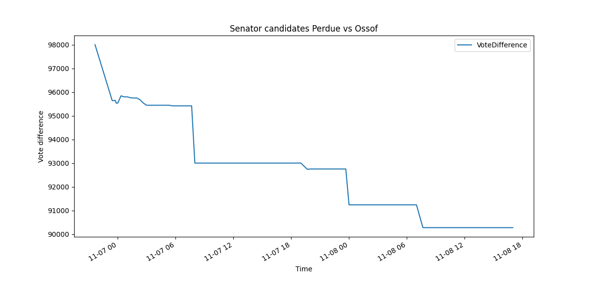

# Real-time US election data 2020 watcher



## Installation
1. Generate SSH key on server
    ```
    ssh-keygen -t ed25519 -C "sivakfil@gmail.com"
    ```
1. Add *write permissions* deploy key
1. Make sure git is cloned with ssh
    ```
    nano .git/config
    ```
